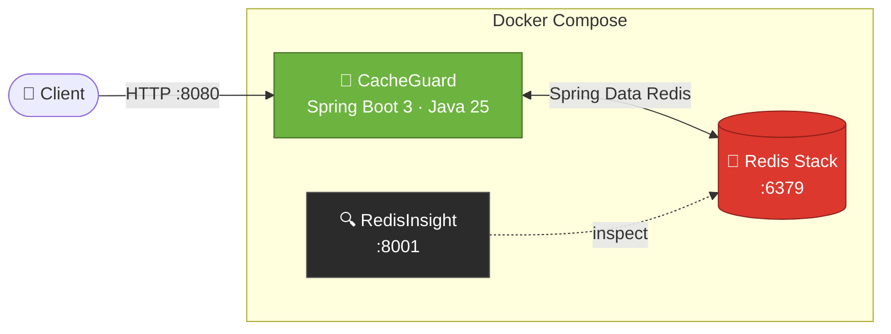

<div align="center">


<p>
  
  
  
  
  
</p>

<p>
  <a href="#-quick-start"><b>Quick Start</b></a> ·
  <a href="#-architecture"><b>Architecture</b></a> ·
  <a href="#%EF%B8%8F-configuration"><b>Configuration</b></a> ·
  <a href="#-api"><b>API</b></a>
</p>

</div>

---

## ✨ Overview

**CacheGuard** is a Spring Boot 3.x service built on **Java 25** that uses **Redis Stack** for caching and Redis-backed workflows such as rate limiting. Redis handles the fast, shared state, and Spring Boot handles the application logic.

The whole stack comes up with a single command, and **RedisInsight** is included so you can see what's happening inside Redis as it happens.

## 🚀 Highlights

| | Feature | Details |
|---|---|---|
| ⚡ | **Redis-powered** | Low-latency caching and shared state on Redis Stack |
| 🛡️ | **Rate limiting** | Redis-backed request guarding for your endpoints |
| 🐳 | **One-command setup** | `docker compose up --build` starts the app and Redis together |
| 🔍 | **Built-in visibility** | RedisInsight UI on port `8001` |
| ❤️ | **Health endpoint** | `GET /api/health` verifies the live Redis connection |
| 🔧 | **Env-driven config** | Override host, port and timeout without touching code |

## 🏗️ Architecture



## ⚡ Quick Start

### 🐳 Option 1 — Docker Compose (recommended)

```bash
git clone https://github.com/nilesh24rit/CacheGuard.git
cd CacheGuard
docker compose up --build
```

| Service | What it is | URL |
|---|---|---|
| 🍃 `app` | CacheGuard (Spring Boot) | http://localhost:8080 |
| 🔴 `redis` | `redis/redis-stack` | `localhost:6379` |
| 🔍 RedisInsight | Redis GUI | http://localhost:8001 |

### 💻 Option 2 — Run locally

Start Redis Stack first (for example via `docker compose up redis`), then:

```bash
mvn spring-boot:run
```

### 📋 Requirements

- ☕ **Java 25**
- 📦 **Maven 3.6.3+**
- 🐳 **Docker & Docker Compose** (for local Redis Stack)

## 🔌 API

### `GET /api/health`

Sends a Redis `PING` and returns `OK` when the connection works.

```bash
curl http://localhost:8080/api/health
# OK
```

## ⚙️ Configuration

Redis settings live in [`src/main/resources/application.yml`](src/main/resources/application.yml) and can be overridden with environment variables.

| Property | Env variable | Default |
|---|---|---|
| `spring.data.redis.host` | `REDIS_HOST` | `localhost` |
| `spring.data.redis.port` | `REDIS_PORT` | `6379` |
| `spring.data.redis.timeout` | `REDIS_TIMEOUT` | `2000ms` |

<details>
<summary><b>Example: pointing at a remote Redis</b></summary>

```bash
REDIS_HOST=my-redis.example.com \
REDIS_PORT=6380 \
REDIS_TIMEOUT=3000ms \
mvn spring-boot:run
```

</details>

## 📁 Project Structure

```text
CacheGuard
├── src/                  # Spring Boot application source
├── Dockerfile            # Container image for the app
├── docker-compose.yml    # App + Redis Stack
└── pom.xml               # Maven build (Java 25, Spring Boot 3.x)
```

## 🧰 Tech Stack

<p>
  
</p>

## 👤 Author

**Nilesh** · [@nilesh24rit](https://github.com/nilesh24rit)

<div align="center">

⭐ If you find this useful, consider giving the repo a star.


</div>
